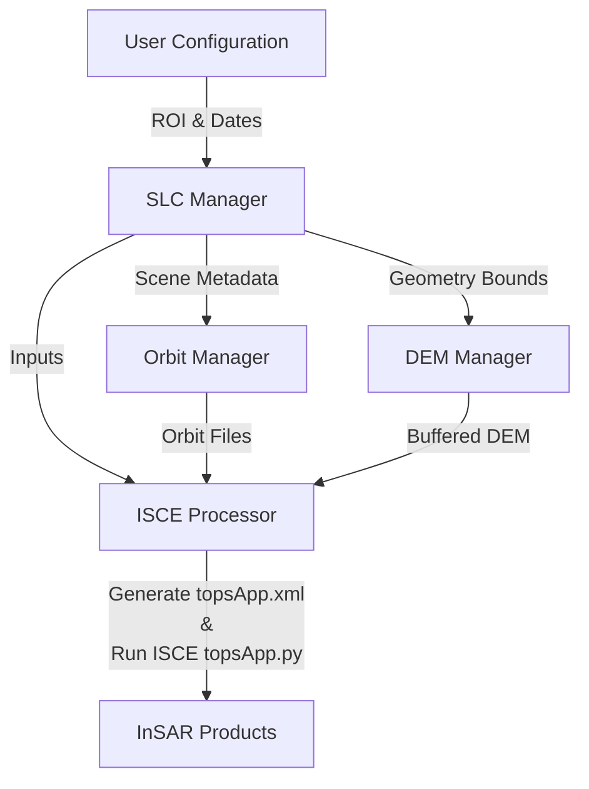

# dInSAR-Toolkit [](https://deepwiki.com/YONGHUNI/dInSAR-Toolkit)
---

# dInSAR-Toolkit

A Python-based automated dInSAR processing toolkit for surface deformation analysis using Sentinel-1 and ISCE2

**Still work in progress!!**

# 🛰️ Modular ISCE2 Sentinel-1 InSAR Pipeline

Automated, modular, and robust wrapper around the ISCE2 `topsApp.py` workflow for Sentinel-1 InSAR processing.

Designed for reproducible end-to-end processing: **search → download → preprocess → run ISCE → visualize displacement**.

This document combines the project overview and example notebook guide into a single, structured README.

---

# 🌟 Key Features

* **Modular Architecture**

* Separate managers for SLC search/download, orbit retrieval, DEM preparation, and ISCE execution.

* **Robust DEM Strategy**

* Automatically builds a DEM covering the full SLC intersection + internal safety buffer.

* Prevents `runTopo` edge errors in mountainous or high-relief terrain.

* **ROI-Focused Processing**

* Processing window is limited to the user ROI for stability and speed.

* **Automated Auxiliary Data**

* Precise orbits (POEORB) with RESORB fallback.

* DEM download via `dem_stitcher` (GLO-30 / SRTM).

* **Modern Python Environment**

* Python 3.10 + Conda compatible.

* Notebook-friendly workflow.

---

# 🏗️ Processing Workflow



---

# 📂 Project Structure

```
./
├── main.py
├── environment.yml
├── README.md
├── modules/
│ ├── __init__.py
│ ├── SLC_manager.py
│ ├── orbit_manager.py
│ ├── DEM_manager.py
│ ├── isce_processor.py
│ └── auth_base.py
└── examples/
  ├── ISCE_processor(INSAR_main).ipynb
  ├── S1SLCManager.ipynb
  ├── OrbitManager.ipynb
  ├── DEMManager.ipynb
  └── README.md
```

---

# 🚀 Getting Started

## 1️⃣ Installation

```bash
git clone https://github.com/YONGHUNI/dInSAR-Toolkit.git
cd dInSAR-Toolkit

conda env create -f environment.yml
conda activate insar_env
```

---

## 2️⃣ Configuration (CLI Arguments)

`main.py` is configured via command-line arguments (not by editing constants inside the file).

Required arguments:

* ROI bounding box (min_lon min_lat max_lon max_lat)
* Start / end date

Example:

```bash
python main.py \
  --roi 129.2 42.2 129.3 42.3 \
  --start 2025-12-20 \
  --end 2026-01-10 \
  --work_dir work \
  --download_dir data/slc \
  --orbit_dir data/orbits \
  --dem_dir data/dem \
  --project insar_project
```

Notes:

* ROI must be provided as a bounding box (not WKT)
* Dates must follow YYYY-MM-DD

---

## 3️⃣ Run Pipeline

Example run:

```bash
python main.py \
  --roi 129.2 42.2 129.3 42.3 \
  --start 2025-12-20 \
  --end 2026-01-10
```

At least two Sentinel-1 SLC scenes must be found in the date range, otherwise the run stops.

---

## 4️⃣ Credentials

A **NASA Earthdata** account is required.

The pipeline will use:

* `.netrc` if present, or
* interactive login on first run.

---

# 📊 Outputs

Generated under the configured `--work_dir` directory.

Example:

```
work/
└── insar_project/
    ├── topsApp.xml
    ├── merged/
    └── products ...
```

Exact files depend on ISCE2 processing results returned by `ISCEProcessor.get_results()`.

Key products:

| File                     | Meaning                                        |
| ------------------------ | ---------------------------------------------- |
| `filt_topophase.unw.geo` | Geocoded unwrapped phase (displacement signal) |
| `topophase.cor.geo`      | Coherence map                                  |
| `phsig.cor.geo`          | Phase sigma (uncertainty proxy)                |

---

# 📚 Example Notebooks

The `examples/` directory contains interactive notebooks demonstrating each module and the full pipeline.

## Notebook Overview

| Notebook                           | Purpose                                |
| ---------------------------------- | -------------------------------------- |
| `S1SLCManager.ipynb`               | ASF search & Sentinel-1 download tests |
| `OrbitManager.ipynb`               | Orbit retrieval tests                  |
| `DEMManager.ipynb`                 | DEM buffering and stitching demo       |
| `ISCE_processor(INSAR_main).ipynb` | Interactive version of `main.py`       |

---

# ▶️ Running Example Notebooks

## Environment

```bash
conda activate insar_env
```

## Launch Jupyter

```bash
cd examples
jupyter lab
```

---

# 🧪 Pipeline Demo Notebook Flow

ISCE_processor(INSAR_main).ipynb

## Step 1 — Configuration

* Define ROI bounding box (min_lon, min_lat, max_lon, max_lat)
* Set date range
* DEM buffer is handled inside the pipeline

## Step 2 — Data Acquisition

* SLC search and download
* Orbit files auto-retrieved

## Step 3 — DEM Preparation

**Large Buffer Strategy**

* DEM covers full SLC intersection
* Adds internal buffer (default 0.2° in code)
* Prevents edge artifacts

## Step 4 — ISCE Execution

* Generate `topsApp.xml`
* Run `topsApp.py`

Typical runtime: tens of minutes to several hours depending on ROI size and scene count.

---

# 📈 Visualization & Scientific Checks

## Coherence Check

File: `topophase.cor.geo`

| Coherence | Interpretation                    |
| --------- | --------------------------------- |
| > 0.5     | Reliable phase (urban, bare soil) |
| < 0.3     | Noisy (vegetation, water)         |

---

## Displacement Conversion

Unwrapped phase → displacement:

```
displacement = phase * (λ / 4π)
```

$$
\Delta d_{\mathrm{LOS}} = \frac{\lambda}{4\pi} \Delta\phi
$$

To convert in meters.

---

# 🛠️ Troubleshooting

## DEM Outside Coverage Error

Increase DEM buffer by editing the value in `main.py`:

```python
dem.prepare_dem(..., buffer_deg=0.3)
```

---

## Authentication Failures

Check:

* Earthdata credentials
* `.netrc` permissions
* ASF / Earthdata login status

---

# 💾 Storage Requirements

Approximate disk usage:

| Component          | Size             |
| ------------------ | ---------------- |
| Sentinel-1 SLC     | 4–8 GB per scene |
| ISCE intermediates | 50–100 GB        |
| DEM tiles          | 1–3 GB           |

Ensure sufficient free space before processing.

---

# 📜 License

See `LICENSE` file for terms.

---
